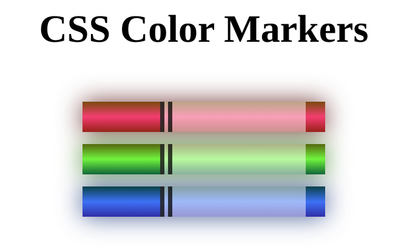

# Color Markers

This is a simple web project that uses HTML and CSS to create a set of colored markers. The project demonstrates how to use different color models (RGB, HEX, HSL) and gradients to create realistic effects. The project also shows how to use multiple classes and inline-block display to style the elements.

## Features

- **Color models**: The project uses three different color models to specify the colors of the markers: RGB (red, green, blue), HEX (hexadecimal), and HSL (hue, saturation, lightness). Each color model has its own advantages and disadvantages, and you can learn more about them [here](https://www.w3schools.com/colors/). The project also uses colors with alpha values (opacity) such as RGBA, HSLA, and HEX with alpha. These colors allow you to control how transparent or opaque the markers are. You can learn more about colors with alpha [here](https://www.w3schools.com/css/css3_colors.asp).
- **Gradients**: The project uses gradients to create smooth transitions between two or more colors. Gradients can make the markers look more realistic and appealing. The project uses linear gradient. You can learn more about gradients [here](https://www.w3schools.com/css/css3_gradients.asp).
- **Classes**: The project uses multiple classes to apply different styles to the same elements. For example, the class `.marker` defines the common properties of all the markers, such as width, height, border-radius, and box-shadow. Then, each marker has its own class (`.red`, `.green`, etc.) that defines its specific color and gradient. This way, you can reuse the same code for different elements and avoid repetition.
- **Inline-block display**: The project uses the `display: inline-block` property to arrange the markers horizontally in a row. This property allows the elements to have a specified width and height, unlike `display: inline` which makes them fit their content. This property also preserves the white space between the elements, unlike `display: block` which creates a line break after each element. You can learn more about display properties [here](https://www.w3schools.com/css/css_display_visibility.asp).

## Preview

## How to run

To run this project, you need a web browser and a code editor. You can either download or clone this repository, or copy the code from the files `index.html` and `style.css`. Then, open the `index.html` file in your browser and see the result.

## How to modify

You can modify this project by changing the colors, sizes, shapes, and positions of the markers. You can also add more markers or remove some of them. To do that, you need to edit the `style.css` file and change the values of the properties. You can use any color model you prefer (RGB, HEX, HSL) or mix them together. You can also use different types of gradients (linear, radial, conic) or combine them with solid colors.

## Credits

This project was created following the lesson from [freeCodeCamp](https://www.freecodecamp.org/learn/2022/responsive-web-design/learn-css-colors-by-building-a-set-of-colored-markers/step-1).

## License

This project is licensed under the MIT License - see the [LICENSE](LICENSE) file for details.